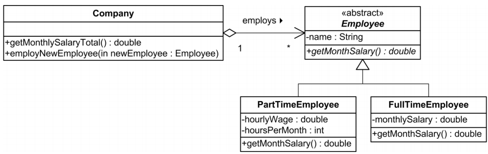

# DNP Exercises week 02 - C#

## Exercise 1, Inheritance and Polymorphism
a) Create a `Student` class that has a `Hi` method printing *“Hi, I’m a student”* to the console. The method should be overwritable. Create a `DNPStudent` class derived from the `Student` class. Have the `DNPStudent` overwrite the `Hi` method with it’s own implementation printing *“Hi, I’m a DNP student!”*.

Consider: How do you call the `Hi` method of the `Student` class from the `DNPStudent` class? Try calling the parent method from `DNPStudent` so that both lines are printed to the console.

b) If a child object is upcast into a parent object, and that child overrides a virtual method on the parent object, which version of the method will be called on the parent object? The child or the parent version? Test your assumption by writing code that tests this scenario. What if the child, instead of overriding, hid the method on the parent class? Does this change the behavior of calling the method on an upcast child object? 

## Exercise 2, Polymorphism
The following class diagram is part of a company’s administrative system.
A part time employee is paid for each hour he/she is working and is hired for a number of hours per month. A full time employee is paid a fixed salary per month.

Implement the classes shown in the class diagram, including attributes and empty operations.

Implement constructors in the classes: `Employee`, `PartTimeEmployee` and `FullTimeEmployee`. The constructors shall take the necessary parameters to initialize all the attributes in the classes.

Implement the necessary functionality in the `GetMonthSalary` operations. The `GetMonthSalary` must return the monthly salary for an employee.

Implement the operation `GetMonthlySalaryTotal` in the class Company. The operation shall calculate the total salary which the company must pay each month. The calculation should be done by calling `GetMonthSalary` on each of the employees and then returning the sum.

Implement the operation `EmployNewEmployee`. The operation shall add a new `PartTimeEmployee` or `FullTimeEmployee` object to the company’s list of employees.

Implement the necessary test in a main method.

## Exercise 3, Interfaces
Make a copy of your solution to the exercise above (implementation of the UML diagram above) and extend the implementation with the following exercise:

The objective of this exercise is to write an `IStudent` interface and a `PartTimeStudent` class that implements it. These may be used in a scenario where employees are allowed to register as part time students; as such one can be an employee and a student at the same time.

- Write an interface, `IStudent`
- Add the method `void Register( int year )`
- Write a class `PartTimeStudent` that inherits from `PartTimeEmployee` and implements the `IStudent` interface. `Register` sets the start year of the education.
Modify your program to allow `PartTimeStudent` classes to be used and tested.

## Exercise 4, Collections
1. Implement an `Animal` class with the following specifications:
    - Animal type as a string
    - Weight as a double value
    - Run speed as an integer value
    - Override `ToString` (specifying the properties of the animal)

1. Create a generic list with 10 Animals (`List<Animal>`) and print all animals in the list.

1. Implement the interface `IComparable` in order to sort the Animals based upon weight and test your implementation by
    - Printing all animals
    - Call `Sort()` method on your list
    - Print all animals again

1. Change your implementation to sort the animals based upon run speed and test it.

## Exercise 5, Namespaces
Create a `Clown` class in it’s own `Funny` namespace. Create another class `Circus` (in a new file). Inside the `Circus` class, create three `Clown` objects. What happens? Is the `Circus` class able to find the `Clown` class? If not, fix it.

## Exercise 6, Indexers
Create a class `Schedule`. The class should use an indexer to store/access string values in a `Hashtable`. That is, the key should be a given `DateTime` object, and the corresponding value should be a `string` containing the classes of that given date.

Create an instance of the `Schedule` class and test it with your own schedule.

Expand the `Schedule` class with a second indexer that overloads the first one. This indexer should take a date `string` (instead of a `DateTime` object) and return the same results as the first indexer by parsing the string to a `DateTime` object.

## Exercise 7, Dictionaries and Properties
Create a `Person` object with some properties (`Name`, `Age`, `Power`). Create a `Dictionary` called *“nicknames”* of type `<string, Person>` which associates a `string` (nickname) with a `Person` object. Create some `Person` objects and store them in the dictionary with nickname keys. Test your dictionary by accessing the values in it based on the provided nickname.

## Exercise 8, Statics
Create a class `Gun` with two static integer fields `gunCount` and `bulletCount` and an integer field `shotsFired`. In the constructor of the class, increment the `gunCount` with one so that this number will increase each time you create a `Gun` object. The `Gun` class should also have a public method `Shoot` that fires the gun by printing *“BANG!”* to the console and incrementing the `bulletCount` AND the `shotsFired` by one.

Test your `Gun` class in the main method of your program. Create three new `Gun` objects and use the fire method on each of them a couple of times. After the guns have been fired, inspect the three fields of the `Gun` class by printing them to the console. What is the difference between `bulletCount` and `shotsFired`?

## Exercise 9, Statics, helper class
Create a `Helper` class that is static and provides you with some helpful helper methods. For example, the Helper class should have a method that adds two numbers together and logs the result to the console. Test your `Helper` class by using its methods from another class.

Consider: Can you create instances of static classes? If not, how do you invoke methods and access properties?
